# 🌤️ SkySync: Multi-Lingual Weather Intelligence

A high-fidelity, performant weather forecasting ecosystem engineered for global accessibility and real-time data precision.

---

## 📝 Overview

**SkySync** is more than a weather app; it's a sophisticated architectural implementation of a real-time data visualization platform. Built with a focus on modularity, it leverages contemporary design paradigms like **Glassmorphism** and high-frequency animations to provide an immersive user experience. The application features advanced multi-language support, including **Hindi**, **Marathi**, and **Hinglish**, making it uniquely accessible for the Indian demographic while maintaining global standards.

## 🏗️ System Architecture

The following diagram illustrates the high-level architecture of the application, highlighting the interaction between the React frontend, the asynchronous service layer, and the external Weather API.

```mermaid
graph TD
    A[index.html] --> B[main.jsx]
    B --> C[App.jsx]
    C --> D[State Management: useState/useEffect]
    D --> E[Service Layer: weatherService.js]
    E -- Fetch API --> F[OpenWeather API]
    
    C --> G[UI Component Layer]
    G --> H[Glassmorphism Input]
    G --> I[Framer Motion Animations]
    G --> J[Lucide React Icons]
    
    D -- i18n Logic --> K[Translation Engine]
    K --> L[EN / HI / MR / HING]
    
    style C fill:#0f172a,stroke:#3b82f6,stroke-width:2px
    style E fill:#1e1b4b,stroke:#8b5cf6,stroke-width:2px
    style F fill:#064e3b,stroke:#10b981,stroke-width:2px
```



## ✨ Key Features

- 🌍 **Multi-Lingual Core**: Native support for English, Hindi, Marathi, and Hinglish.
- 🧊 **Glassmorphism UI**: A premium, translucent interface with GPU-accelerated backdrop filters.
- 🎭 **Motion Intelligence**: Smooth, physics-based transitions powered by `framer-motion`.
- 📍 **Hyper-Local Accuracy**: Real-time data fetching for precise location-based weather reporting.
- 📱 **Mobile-First Responsive**: Optimized layouts for every screen dimension, from smartwatches to desktops.
- ⚡ **Optimized Performance**: Built with Vite for near-instant load times and minimal bundle size.

## 🛠️ Tech Stack

### Frontend & Logic
- **React 18/19**: Declarative UI development.
- **Vite**: Ultra-fast build tool and dev server.
- **Framer Motion**: Advanced animation orchestrations.
- **Lucide React**: High-quality vector iconography.

### API & Services
- **OpenWeatherMap API**: The backbone for real-time meteorological data.
- **Native Fetch API**: Asynchronous data retrieval with robust error handling.

## 🚀 Getting Started

### Prerequisites
- Node.js (v16.x or higher)
- npm (v7.x or higher)
- OpenWeather API Key (Set in `.env`)

### Installation & Local Execution

```bash
# Clone the repository
git clone https://github.com/kartikshete/weather-app.git

# Navigate to project directory
cd weather-app

# Install dependencies
npm install

# Run the development server
npm run dev
```

## 🌐 Deployment Pipeline

The project is optimized for automated CI/CD deployment on Vercel or Netlify.

- **Build Command**: `npm run build`
- **Output Directory**: `dist/`

---

## 👩‍💻 Developer

**Kartik Shete**  
*Building premium digital experiences with a focus on performance and accessibility.*

---
© 2026 Kartik Shete. All rights reserved.
